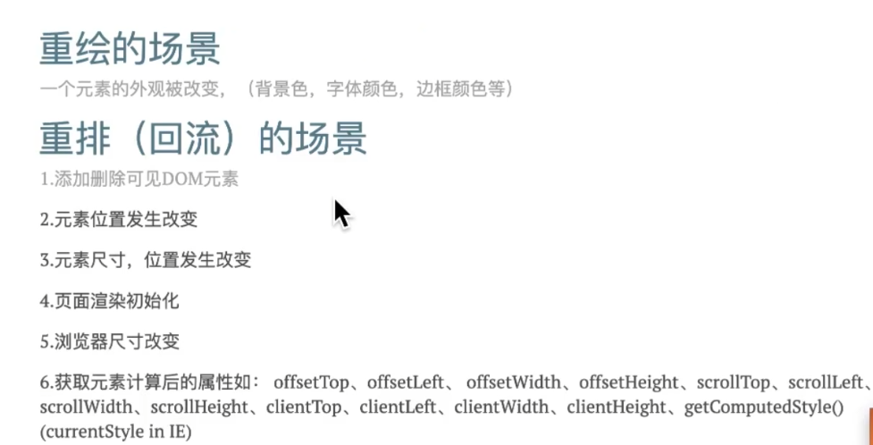

## HTML5

- 新元素 更好的语义化

  - 代码结构清晰、方便阅读
  - 方便其他设备(盲人阅读器、移动设备)解析,以语义的方式渲染网页
  - 有利于 SEO

- 表单功能增强

- canvas+SVG 图形绘制，使用 JS 脚本操作

- Web 存储(localStorage)
  相关[cookie、session](../cookies-session/readme.md)

- 拖放(draggable)

- 地理定位(geolocation)

- 音频(Audio) & 视频(Video)

- web worker 运行在后台的 JS，独立于其他脚本，而不会影响页面，(相当于实现多线程并发)

- WebSocket 单个 TCP 连接上进行全双工通信的协议

- 重绘 重排
  1. 重排必重绘，重绘不一定重排
  2. 减少重排，尽量重绘
  3. 重绘
     - 元素外观改变(背景色、字体颜色等)
  4. 重排
    - 添加删除可见DOM元素
    - 元素位置发生改变
    - 元素尺寸发生变化
    - 页面渲染初始化
    - 浏览器尺寸改变
    - 获取元素计算后的属性(offsetTop等)
