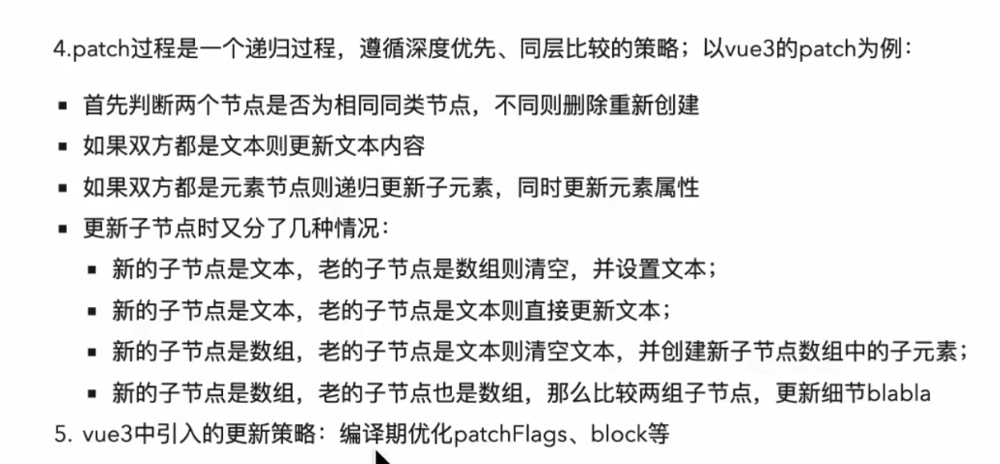

### vue

- [原理](https://cn.vuejs.org/v2/guide/reactivity.html):
  两个特性：使用`Object.defineProperty`进行数据劫持，使用发布-订阅者模式

  - 具体实现(简单描述)： 1.遍历 data 对象，使用`Object.defineProperty`劫持数据，修改 getter/setter,读取数据时触发 getter，修改数据时触发 setter 2. 在 getter 中收集依赖(Watcher：每个组件实例都对应一个 watcher 实例)，当依赖项的 setter 触发时，通知依赖(watcher)，数据发生改变 3. 在 Dep 类中存放收集的依赖，由 Dep.notify 方法通知依赖去修改数据 4. 使用 Observer 类将一个 Object 中的所有数据转换成响应式的
  - 缺点：
    1. 对于每个数据，都要进行劫持，每次数据变化时，都要触发 getter/setter，导致性能问题
    2. 无法监听数组的变化，只能监听对象的变化
    3. 维护大量的 dep 实例和 watcher 实例，影响性能
    4. 新增、删除对象属性无法拦截，只能使用提供的 API(set/delete)
    5. 不支持 map/set 等数据结构
  - 追踪侦测数组的解决方法：重写数组的 7 个方法拦截原型(['push', 'pop', 'shift', 'unshift', 'splice', 'sort', 'reverse'])

- vue3 使用[`proxy`](../ES6/README.md#proxy)重构，可以原生监听数组，也可以监听对象属性的添加和删除

  - 缺点：由于`proxy`是 ES6 的语法，对低版本浏览器不兼容，这也是 vue 只兼容到 IE11 的原因

- [name](https://cn.vuejs.org/v2/api/#name)

  1. 配合 [keep-alive](#keep-alive) 对组件缓存做限制(include/exclude='name')
  2. vue 组件模版调用自身

- [data](https://cn.vuejs.org/v2/api/#data)

  - `data`为什么必须是函数？
  - 复用组件时，调用函数返回新对象，它们的内存地址不一样，不会相互影响。

- [生命周期](https://cn.vuejs.org/v2/guide/instance.html#%E7%94%9F%E5%91%BD%E5%91%A8%E6%9C%9F%E5%9B%BE%E7%A4%BA)

  - beforeCreate -> created -> beforeMount -> mounted -> beforeUpdate -> updated -> beforeDestroy -> destroyed
  - [特殊的生命周期](https://cn.vuejs.org/v2/api/#activated)
    - activated(被 [keep-alive](#keep-alive) 缓存的组件激活时调用) -> deactivated(被 keep-alive 缓存的组件失活时调用)
    - errCaptured 捕获子孙组件错误时调用
      
  - 每个周期做了什么
    - 在`beforeCreate`中，实例初始化,data 和$el 还没有初始化为 undefined；
    - 在`created`中，data 初始化完成，可以获取到 data，$el 还没有初始化；
    - 在`beforeMount`中，$el 已存在，此时为虚拟 dom
    - 在`mounted`中，可以获取到 dom
      

- <a id="keep-alive"></a>[keep-alive](https://cn.vuejs.org/v2/guide/components-dynamic-async.html#%E5%9C%A8%E5%8A%A8%E6%80%81%E7%BB%84%E4%BB%B6%E4%B8%8A%E4%BD%BF%E7%94%A8-keep-alive)

  - 对希望缓存状态的动态组件进行包裹，可以使组件在切换时不会重新加载，也可以避免反复渲染导致的性能问题

- [nextTick](https://cn.vuejs.org/v2/api/#Vue-nextTick):在下次 DOM 更新循环结束之后执行延迟回调。在修改数据之后立即使用这个方法，获取更新后的 DOM。

  - 原理：js 的[事件循环](../%E4%BA%8B%E4%BB%B6%E5%BE%AA%E7%8E%AF/README.md)
    > Vue 异步执行 DOM 更新。只要观察到数据变化，Vue 将开启一个队列，并缓冲在同一事件循环中发生的所有数据改变。如果同一个 watcher 被多次触发，只会被推入到队列中一次。这种在缓冲时去 除重复数据对于避免不必要的计算和 DOM 操作上非常重要。然后，在下一个的事件循环“tick”中，Vue 刷新队列并执行实际 (已去重的) 工作。
  - 理解：使用 promise.then 实现一个微任务，我们传入的 callback 会被添加到队列中刷新函数的后面，等到队列内部刷新函数执行完毕，那后面的 callback 自然能获取到 dom

- [组件间通信方式](https://juejin.cn/post/6844903918753808398#heading-15)

  1. props 与 $emit/~~$on~~ 父子组件通信
  2. ref 与 $parent/~~$children~~ 父子组件通信


  
  3. eventBus 父子、隔代、兄弟组件通信
  4. $attrs/~~$listeners~~ 隔代组件通信
  5. provide/inject 隔代组件通信
  6. [vuex](./vuex.md) 父子、隔代、兄弟组件通信
     > `eventbus`创建事件总线并将其导出，以便其它模块可以使用或者监听它。
     > 标记的 3 个 API 在 vue3 中已废弃

  ```js
  //创建事件总线  event-bus.js
  import Vue from "vue";
  export const EventBus = new Vue();

  //a.vue
  import { EventBus } from "../event-bus.js";
  EventBus.$emit("something", callback(payload1,…));

  //b.vue
  import { EventBus } from "../event-bus.js";
  EventBus.$on("something", function(payload1,…){});
  ```

```

- watch 和 computed 的区别 [查看](https://juejin.cn/post/6990889410778628126)

  - computed: 对于任何复杂逻辑，你都应当使用计算属性。与函数不同的是，计算属性基于响应式依赖进行缓存，只有相关依赖改变时才会重新求值
  - watch: 当数据需要随着其他数据变动而变动时，需要在数据变化时执行异步或开销较大的操作时，这个方式是最有用的。
  - 如果一个数据依赖于其他数据，那么把这个数据设计为computed的；如果你需要在某个数据变化时做一些事情，使用watch来观察这个数据变化

- key 的作用
  1. 更高效对比虚拟 DOM 中节点
  2. vue 在`patch`过程中，`key`是必要条件
  3. 应避免使用数组索引作为key，可能导致隐形bug
```

### [Mixin](https://v3.cn.vuejs.org/guide/mixins.html#%E5%9F%BA%E7%A1%80)

- 提供了一种灵活的方式，分发组件中可复用的功能，定义一个 `mixin 对象`，可包含任意组件选项；当组件使用该 `mixin 对象`，则 `mixin 对象`的选项会被“`混合`”进组件选项中

```js
// 定义一个 mixin 对象
const myMixin = {
  created() {
    this.hello();
  },
  methods: {
    hello() {
      console.log("hello from mixin!");
    },
  },  
};

// 定义一个使用此 mixin 对象的应用或组件
const app = Vue.createApp({
  mixins: [myMixin],
});

app.mount("#mixins-basic"); // => "hello from mixin!"
```

- 选项合并：
  - 钩子函数：mixin 对象的钩子将会在组件钩子之前调用
  - data：合并时，若出现同名内容，优先使用组件自身数据
  - 其他对象选项：如`methods`、`components` 和 `directives`，若出现同名，组件对象的键值对有限

### v-for 和 v-if

- 在 vue2 中，`v-for`的优先级更高；在 vue3 中，`v-if`的优先级更高
- 实践中，应避免放在一起使用。
  - 在 vue2 中，由于`v-for`的优先级更高，会先执行循环再判断条件，哪怕只渲染列表中一小部分元素，也得每次重渲染时遍历整个列表，浪费性能；
  - 在 vue3 中，`v-if`的优先级更高，所以执行时，调用的变量还不存在，会导致异常。

### 单向数据流(子组件不能修改父组件数据)

- 简单，避免数据复杂性
- 怎么修改父组件数据？ 子组件派发(`emit`)一个事件，让父组件去修改

### 权限管理

- 常见： 页面权限、按钮权限
- 页面权限：项目比较小，我所使用的是，在前端写死所有路由，登录后请求角色信息，过滤不可查看的页面，最后通过`router.addRoutes(accessRoutes)`的方式动态添加路由
  纯后端方案：所有页面信息存储在数据库中，后台根据用户信息查询可访问页面，将信息传给前端，最后通过`router.addRoutes(accessRoutes)`的方式动态添加路由
- 按钮权限：`v-permission`确认用户角色权限

### ref 和 reactive

- ref 用来包装原始值：number、boolean 等等，reactive 包装对象类型

### vue3 新特性

1. composition API
2. SFC composition API 语法糖(script setup)
3. teleport
4. fragments
   > vue 为什么可以多根节点？ 因为编译器自动添加`fragments`包裹

### 虚拟 DOM

- 什么是 vdom？
  使用 JS 对象描述视图结构，模拟 DOM 对象，
- vdom 的好处？
  1. 将真实节点抽象成 VNode，有效减少操作 DOM 次数
  2. 在浏览器中，js 消耗的性能远远小于 DOM 操作消耗的性能，所以使用虚拟 DOM 可以减少消耗
  3. 另外，直接操作 DOM 是有限制的，因为 diff、clone 等操作，而真实节点上有许多内容，直接 diff 操作，会额外 diff 一些没必要的内容。但是，将这些操作转移到 JS 对象上会更简单
  4. 方便实现跨平台
- diff 算法
  1. render 函数获取新节点
  2. 将新旧节点传入 patch
  3. patch：深度优先、同层比较(如果出现非同层，就直接删除重建，保证复杂度)
     
