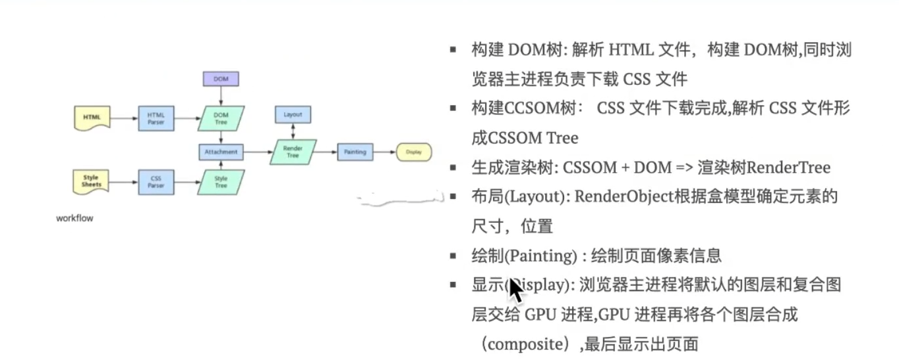

### 长列表

当后端给出 10 万条数据，怎么渲染？[查看](https://juejin.cn/post/6844903982742110216)

- 分批次渲染(setTimeout 模拟多线程)
- 虚拟列表(只渲染`可见区域`内，`不可见区域`不渲染或部分渲染)

### 闭包

什么是闭包？[查看](https://juejin.cn/post/6937469222251560990)

> 在 JS 忍者秘籍(P90)中对闭包的定义：闭包允许函数访问并操作函数外部的变量。
> 红宝书上对于闭包的定义：闭包是指有权访问另外一个函数作用域中的变量的函数。
> MDN 对闭包的定义为：闭包是指那些能够访问自由变量的函数。自由变量是外部函数作用域中的变量。

> 概述：闭包是指有权访问另一个函数作用域中变量的函数

    - 外层函数调用后，外层函数的作用域对象，被返回的内层函数的作用域链引用着，无法释放，就形成了闭包

- 作用：
  1. 保护函数的私有变量不受外部的干扰。形成不销毁的栈内存。
  2. 实现方法和属性的私有化
- 注意：容易导致内存泄漏，需要谨慎使用

### 浏览器渲染过程

### 文件上传

1. 切片，文件`FIle对象`是`Blob对象`的子类，`Blob对象`包含一个重要的方法`slice`，通过这个方法，我们就可以对二进制文件进行拆分成多个上传请求
2. 所有上传请求完毕后，通知服务器合并切片
3. 注意控制多个请求的并发量：`Promise.race`和`异步函数`实现,
4. 注意断点续传：某个请求失败后触发`catch`方法， 将该请求放入失败列表，在一轮请求完成后，处理失败请求
